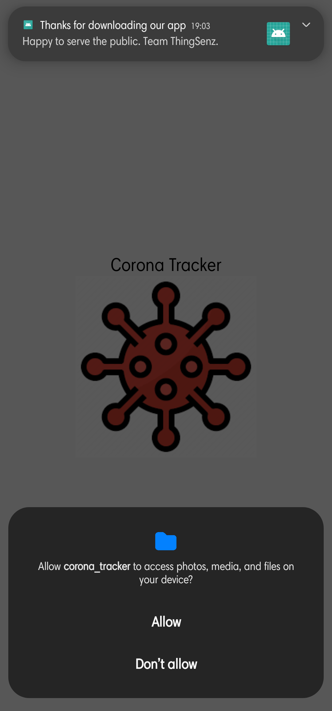
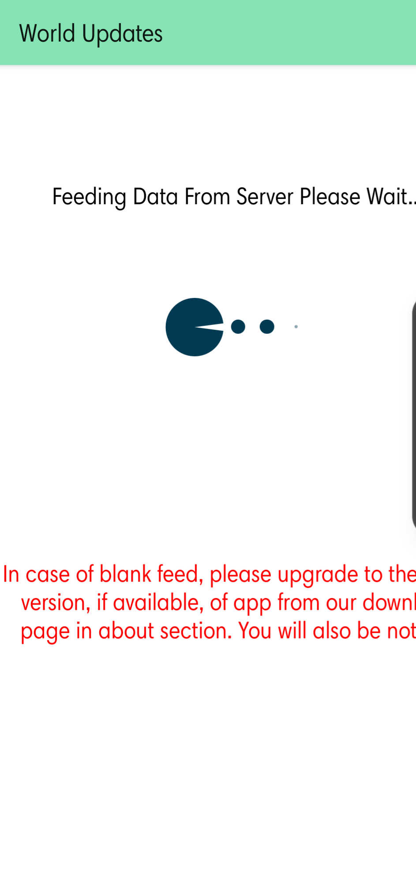
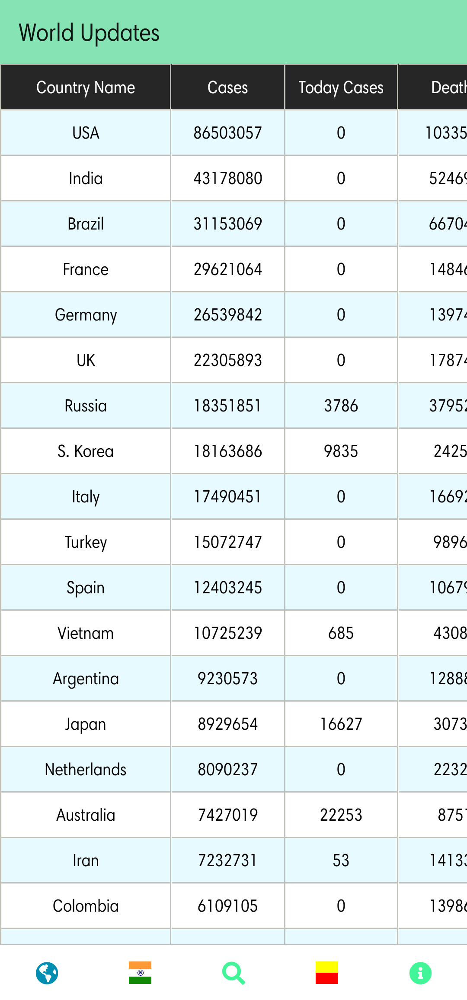
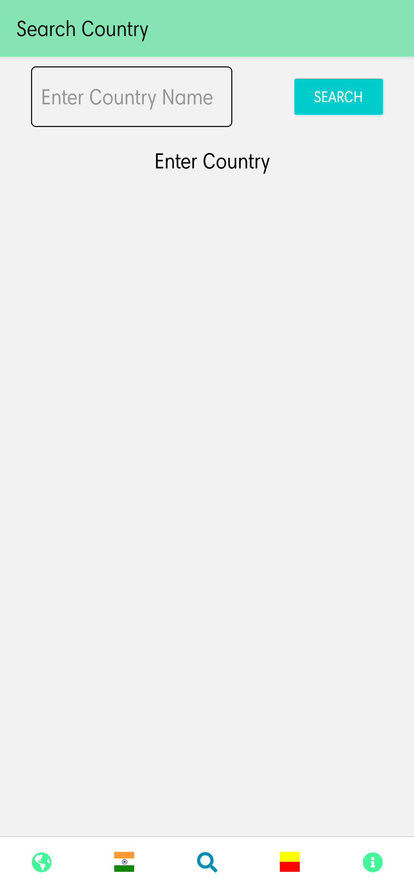
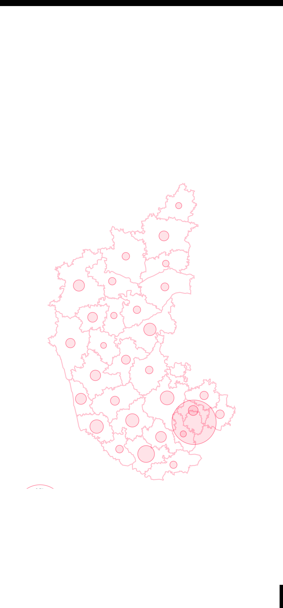
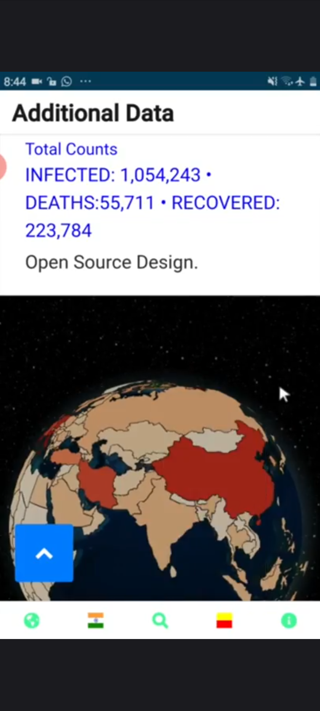
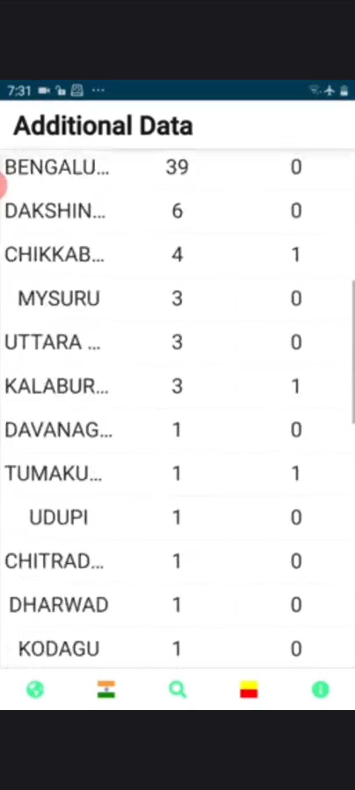
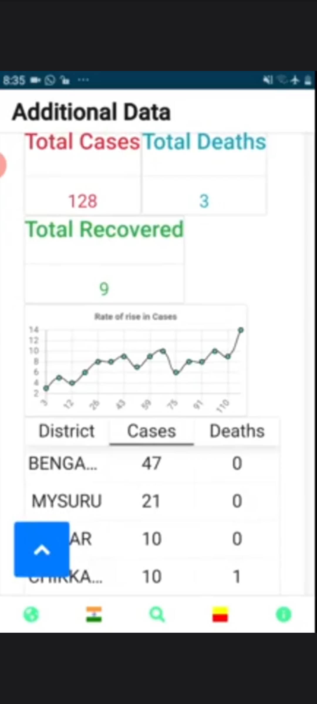

# covid19_tracker
### Deprecated
An app to track the covid-19 infections worldwide with India preset and  attached content for Karnataka statistics and links to other reliable website
for India-specific statistics.

This application was developed during the corona period to to provide a single endpoint for users to access Covid-19 infections worldwide.
The data was fetched using novelcovid npm package which relied on corona.lmao.ninja in package version 1.2.4 for fetching the statistics.
The application was dedicated towards India and the state of Karnataka in general and hence had an api endpoint dedicated to displaying the statistics
of covid infections in districtwise tabular format for the state of Karnataka. It was updated daily during the first wave of covid pandemic but thereafter
limited and decided to discontinue due to the resources involved for maintainance, development of vaccines and subsequent waves.

## Tools
- React Native for the Android Application
- React.JS for Karnataka website
- Node.JS and Express.js for backend server handling the data requests
- MongoDB for data storage of covid cases for Karnataka
- Heroku and Github for app deployment to serve the public.

## Screenshots
<table>
  <tr>
    <td></td>
    <td></td>
    <td></td>
  </tr>
  <tr>
    <td></td>
    <td></td>
    <td></td>
  </tr>
  <tr>
    <td></td>
    <td></td>
  </tr>
</table>

## Featured on youtube
[Youtube Link](https://youtu.be/8O7d-PnmffQ)

## Dependencies
[NovelCovid](https://www.npmjs.com/package/novelcovid)

[Contact Us](mailto:thingsenz@gmail.com)
